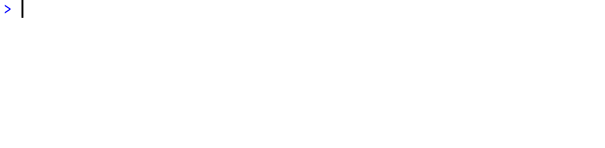

<!-- README.md is generated from README.Rmd. Please edit that file -->

```{r, include = FALSE}
knitr::opts_chunk$set(
  collapse = TRUE,
  comment = "#>",
  fig.path = "man/figures/README-",
  out.width = "100%"
)

# remotes::install_github("GuangchuangYu/badger")
library(badger)
```

# twenty48 

<!-- badges: start -->
`r # badge_cran_release(color = "brightgreen")`
`r badge_lifecycle("experimental")`
`r badge_license(color = "blueviolet")`
`r # badge_github_actions(action = "R-CMD-check")`
`r # badge_codecov()`
`r # badge_dependencies()`
<!-- badges: end -->

A clone of [Gabriele Cirulli's 2048](https://github.com/gabrielecirulli/2048) in R.

## Installation

<!-- You can install the released version of **twenty48** from [CRAN](https://cran.r-project.org/package=twenty48) with: -->

<!-- ``` {r eval = FALSE} -->
<!-- install.packages("twenty48") -->
<!-- ``` -->

You can install the development version of **twenty48** from [GitHub](https://github.com/rossellhayes/twenty48) with:

``` {r eval = FALSE}
# install.packages("remotes")
remotes::install_github("rossellhayes/twenty48")
```

## Example



---

Hex sticker font is [Source Sans Pro](https://github.com/adobe-fonts/source-sans-pro) by [Adobe](https://www.adobe.com).

Recording made with [ScreenToGif](https://github.com/NickeManarin/ScreenToGif/) by [Nicke Manarin](https://github.com/NickeManarin).

Please note that **twenty48** is released with a [Contributor Code of Conduct](https://contributor-covenant.org/version/2/0/CODE_OF_CONDUCT.html). By contributing to this project, you agree to abide by its terms.
