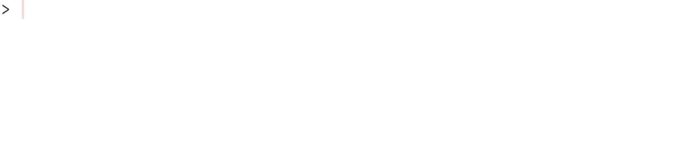

<!-- README.md is generated from README.Rmd. Please edit that file -->

# twenty48 

<!-- badges: start -->

[](https://cran.r-project.org/package=twenty48)
[](https://lifecycle.r-lib.org/articles/stages.html#stable)
[](https://cran.r-project.org/web/licenses/MIT)
[](https://github.com/rossellhayes/twenty48/actions)

<!-- badges: end -->

A clone of [Gabriele Cirulli’s
2048](https://github.com/gabrielecirulli/2048) in R.

## Installation

You can install the released version of **twenty48** from
[CRAN](https://cran.r-project.org/package=twenty48) with:

``` r
install.packages("twenty48")
```

or the development version from
[GitHub](https://github.com/rossellhayes/twenty48) with:

``` r
# install.packages("pak")
pak::pkg_install("rossellhayes/twenty48")
```

## Example



------------------------------------------------------------------------

Hex sticker font is [Source Sans by
Adobe](https://github.com/adobe-fonts/source-sans).

Recording made with [ScreenToGif by Nicke
Manarin](https://github.com/NickeManarin/ScreenToGif/).

Please note that **twenty48** is released with a [Contributor Code of
Conduct](https://contributor-covenant.org/version/2/0/CODE_OF_CONDUCT.html).
By contributing to this project, you agree to abide by its terms.
